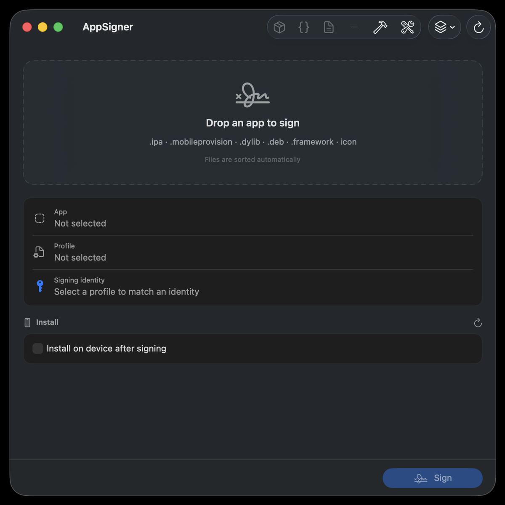

<div align="center">


# AppSigner

**A native macOS app to re-sign iOS apps (`.ipa`) with a Keychain identity.**

[](https://swift.org)
[](https://www.apple.com/macos/)
[](LICENSE)

</div>

AppSigner re-signs an iOS `.ipa` using a code-signing identity read **directly from your
Keychain** and a provisioning profile. It can also inject dynamic libraries, replace the
app icon, edit bundle metadata, and install the result on a connected device — all from a
small, native SwiftUI interface.

The whole signing engine (`SigningKit`) is written from scratch in Swift. It does **not**
depend on any third‑party re-signing tools. The only external programs it calls are
Apple's own system tools (`codesign`, `zip`/`unzip`) and — for the optional on-device
install — the standard [libimobiledevice](https://libimobiledevice.org) suite.

<div align="center">
  
</div>

---

## Features

- **Sign with a Keychain identity** — identities are read natively via the Security
  framework and automatically matched to the certificate embedded in your provisioning
  profile. No shelling out to `security`.
- **Native provisioning-profile parsing** — team, expiry, type (Development / Ad Hoc /
  App Store / Enterprise), app-id and entitlements, parsed in pure Swift.
- **Native dylib injection** — adds an `LC_LOAD_DYLIB` command straight into the Mach-O
  header (thin **and** fat binaries), weak-linked by default so a missing library can
  never crash the app. No `optool` or external injector.
- **IPA explorer & dylib manager** — scans every Mach-O in the bundle (main app, app
  extensions, frameworks, dylibs, watch app), lists each library reference with its
  state (weak/strong, bundled/missing/jailbreak) and who else uses it, and lets you
  **remove references, make them weak, or delete whole bundle entries** — app
  extensions, watch apps, frameworks, resource bundles, localizations — during signing.
- **Pre-flight checks** — before you sign, it flags FairPlay-encrypted binaries, expired
  or soon-to-expire profiles, an identity the profile does not authorize, a bundle id
  that a non-wildcard profile will not cover, extensions that need their own profiles,
  a connected device that is not provisioned, missing libraries, jailbreak-only paths,
  a missing arm64 slice, and entitlements your profile will drop.
- **Icon replacement** — generates the standard iOS icon sizes and overrides the app
  icon, including icons compiled into `Assets.car` (see [notes](#notes--limitations)).
- **Metadata editing** — change the Bundle ID, display name, version and build number.
- **On-device install** — install the signed IPA over USB via `ideviceinstaller`.
- **External-tools manager** — detect, install and update the optional tools (Homebrew
  formulae, plus a GitHub-releases link for the legacy `optool`).
- **Signature verification** — every run finishes with `codesign --verify --deep --strict`.

## Requirements

- macOS 14 or later (Apple Silicon or Intel)
- Swift 6.x toolchain / Xcode 16+
- A valid Apple code-signing identity in your Keychain and a matching provisioning
  profile (the private key for the profile's certificate must be present)
- *Optional, for on-device install:* `brew install ideviceinstaller`

## Build & run

```bash
# Run the test suite
swift test

# Build and launch the app
./Scripts/package_app.sh release
open AppSigner.app
```

`package_app.sh` compiles a release build, assembles a proper `AppSigner.app` bundle
(with the icon and `Info.plist`), and ad-hoc signs it so it launches as a normal app.
You can also open `Package.swift` in Xcode and run the `AppSigner` target.

## Usage

1. **Drop your files** onto the single drop zone — the app sorts them by type
   automatically:
   - `.ipa` → the app to sign
   - `.mobileprovision` → the provisioning profile
   - `.dylib` → libraries to inject
   - an image (`.png`/`.jpg`/…) → the replacement icon
2. AppSigner reads your Keychain and selects the identity that matches the profile.
3. Optionally edit the **Bundle ID / name / version / build**.
4. *(Optional)* open **Contents** to inspect the bundle and tick anything to strip out —
   tweak libraries, app extensions, a watch app, large resources — and review the
   **pre-flight** findings above the Sign button.
5. *(Optional)* enable **Install on device after signing** and pick a connected device.
6. Press **Sign**. A live process screen shows each step: unpack → edit → embed profile →
   inject → replace icon → sign (inner → outer) → verify → repack.
7. The signed `<name>_Signed.ipa` is written next to the input, ready to install.

## How it works

The signing pipeline runs entirely against absolute paths in a temporary working
directory that is always cleaned up:

```
unpack IPA  ->  edit Info.plist        ->  embed provisioning profile
            ->  apply bundle edits      (strip dylib references / delete entries)
            ->  inject dylibs (weak)    ->  replace icon
            ->  extract entitlements    ->  codesign each component
                (inner → outer: frameworks, dylibs, app extensions, then the .app)
            ->  verify (codesign --verify --deep --strict)  ->  repack the IPA
```

Nothing touches your original `.ipa`: every run works on a fresh temporary copy that is
always cleaned up.

See [docs/ARCHITECTURE.md](docs/ARCHITECTURE.md) for the module breakdown.

## Testing

```bash
swift test                              # unit tests (offline, no device needed)
APPSIGNER_INTEGRATION=1 swift test      # + end-to-end signing against a real .ipa*
APPSIGNER_NET=1 swift test              # + live GitHub-release tests
```

\*The integration tests look for a real `.ipa` and a matching identity in your workspace
and skip themselves when those are not present. Unit tests use a bundled, non-sensitive
sample profile and never require any real signing material.

## Notes & limitations

- **Ad Hoc / Development profiles install only on their provisioned devices.** A device
  whose UDID is not in the profile will refuse the app.
- **`codesign` is required and cannot be replaced** — there is no public API to produce
  an Apple code signature; every signing tool ultimately calls `codesign`.
- **Icon / `Assets.car`.** iOS resolves the primary icon from `Info.plist` first, so
  AppSigner overrides the icon by writing loose PNGs for both the standard `AppIcon`
  names *and* the app's existing icon reference names, and by removing `CFBundleIconName`.
  It does **not** recompile the binary `Assets.car` (Apple's tools cannot do that without
  the original asset sources), which is unnecessary for the override to take effect.
- **`optool` is not used.** Dylib injection is implemented natively. `optool` appears only
  in the tools panel as a convenience for legacy workflows and is never executed.

## Legal & ethical use

AppSigner is a developer tool for re-signing apps **you own or are authorized to
modify** — for testing, sideloading your own builds, or research on your own devices.
Do not use it to infringe copyrights, bypass licensing, or redistribute other people's
software. You are responsible for complying with all applicable laws and agreements.

## Contributing

Contributions are welcome — see [CONTRIBUTING.md](CONTRIBUTING.md). The codebase follows
test-driven development; please keep new logic in `SigningKit` covered by tests.

## License

[MIT](LICENSE) © jkbroot
